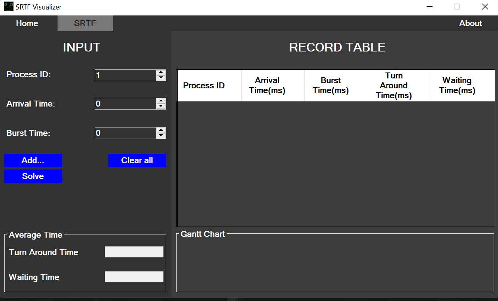

# SRTF-Visualizer

SRTF visualizer is a C# based program with GUI(Windows Forms) to show the SRTF algorithm 

## Demonstration

## Features

- Simple UI and Dark Mode
- With Gantt Chart

## Credits

- SRTF function Core: https://github.com/Zain-Bin-Arshad/OS-Scheduling
- UI Inspired from https://github.com/RJCodeAdvance

## Note

Remark of the professors:

- idle time missing
- turnaround confusion and missing completion column in record table
- inaccurate ganttchart end time

This is my final project 1st sem of 2nd year in CS and if you want, you can improve or use as learning purposes.
